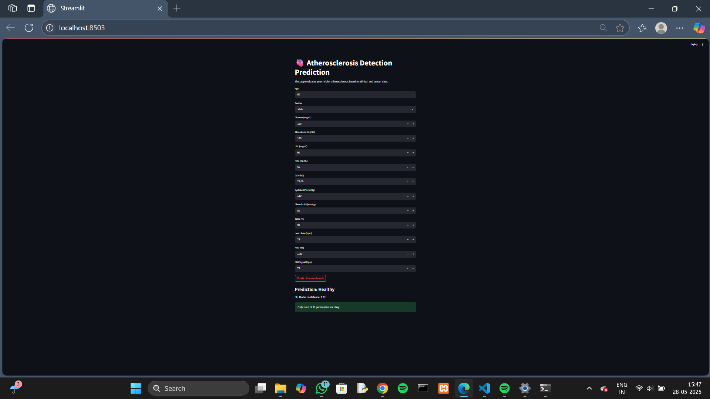
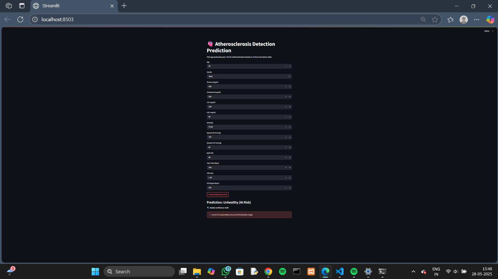

#  Deep Learning Based-Early Detection of Atherosclerosis for Stroke Prevention

This project uses deep learning to predict the risk of atherosclerosis based on both clinical and sensor data. The goal is early detection to prevent stroke-related complications.

---

## 📂 Project Structure

- **`data/`**: Contains the combined CSV datasets of healthy and unhealthy individuals.
- **`arduino/`**: Arduino sketches and Python scripts to read sensor data (ECG, PPG, GSR, BP) and save to CSV.
- **`streamlit_app/`**: Streamlit frontend for user input and prediction display.
- **`models/`**: Trained CNN-LSTM model and the scaler used for feature normalization.
- **`outputs/`**: Screenshot examples of predictions (Healthy & Unhealthy).
- **`requirements.txt`**: Python dependencies.

---

## ⚙️ Tools Used

- Arduino + Sensors (ECG, GSR, PPG, BP)
- Python (Pandas, NumPy, TensorFlow/Keras)
- Streamlit (Frontend UI)
- CSV for data storage

---

## 🖼️ UI Preview

### ✅ Healthy Prediction:


### ❌ Unhealthy Prediction:


---

## 🚀 How to Run

1. Clone the repository
2. Install dependencies:

```bash
pip install -r requirements.txt
